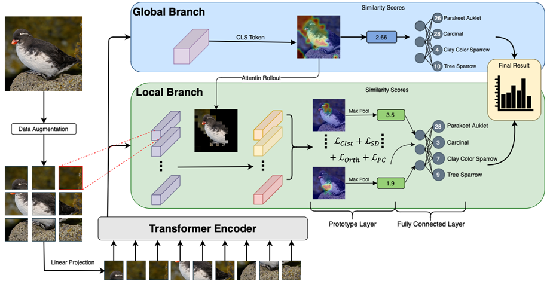

# XPT: eXplainable Prototype-based Transformer for Efficient Few Shot Image Classification

## Introduction
XPT is a special transformer architecture designed for Explainable FSL (Few Shot Learning).  

The workflow and the overall archtecture is shown below: 



## Usage
### Set environment
All the needed packages are already in environment.yml.

Run  ``` conda env create -f environment.yml ```. 

## Train

The training scripts for CUB, Dogs and Cars are `scripts/fsl_cub.sh`, `scripts/fsl_miniImagenet.sh`, `scripts/fsl_tieredimagenet.sh`, respectively.

The format instruction of training is as below:

```
sh scripts/fsl_cub.sh $backbone $batch_size $num_gpus
```

Here, `$backbone` is chosen from [`deit_tiny_patch16_224`, `deit_small_patch16_224`, `cait_xxs24_224`], `$batch_size` denotes batch size, and `$num_gpus` denotes the number of gpus for training. An example for training a ProtoPFormer of backbone `deit_tiny_patch16_224` on CUB with batch size 64 and 1 gpus is as below:

```
sh scripts/train_cub.sh deit_tiny_patch16_224 64 1
```

## Visualize

The format instruction of training is as below:

```
sh scripts/visualize.sh $backbone $data_set $output_dir $use_gauss $modeldir $modelfile
```

An example for visualizing a ProtoPFormer of backbone `deit_tiny_patch16_224` on CUB with a checkpoint file `output_cosine/CUB2011U/deit_tiny_patch16_224/1028--adamw-0.05-200-protopformer/checkpoints/epoch-best.pth` is as below:

```
sh scripts/visualize.sh deit_tiny_patch16_224 CUB2011U output_view/test False output_cosine/CUB2011U/few_shot_cosine_distence/1028--adamw-0.05-200-protopformer/checkpoints epoch-best.pth 
```

Noted that `$use_gauss` denotes whether visualizing gaussian shape, it will be much slower if `$use_gauss` is True.

## Evaluating Interpretability

We borrow the evaluation code from [EvalProtoPNet](https://github.com/hqhQAQ/EvalProtoPNet) to evaluate the interpretability score of ProtoPFormer.

```
python eval_interpretability.py \
--gpuid=0 \
--base_architecture=deit_tiny_patch16_224 \
--reserve_layers=11 \
--data_path=datasets/CUB_200_2011/ \
--prototype_shape 2000 192 1 1 \
--use_global=True \
--global_proto_per_class=10 \
--resume=output_cosine/CUB2011U/deit_tiny_patch16_224/1028--adamw-0.05-200-protopformer/checkpoints/epoch-best.pth \
--global_coe=0.5 \
--reserve_token_nums=81 \
--use_ppc_loss=True \
--batch_size=32 \
--out_dir=output_view
```
